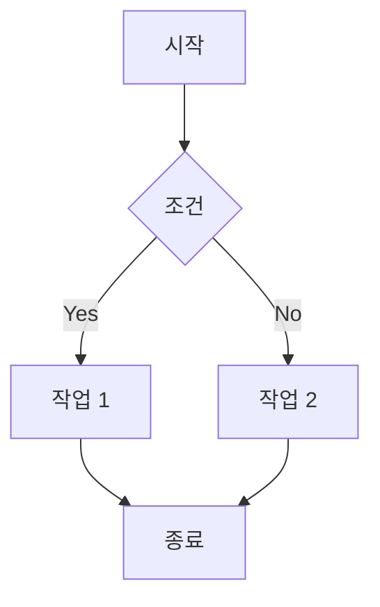

# 주경야근 블로그 설정 가이드

## 기본 설정

### 1. 사이트 정보 설정

`src/_data/site.json` 파일을 수정하세요:

```json
{
  "title": "주경야근",
  "description": "프로그래밍, 데이터분석, IT 트렌드에 대한 기술 블로그",
  "url": "https://yourdomain.com",
  "author": {
    "name": "당신의 이름",
    "bio": "간단한 소개",
    "github": "https://github.com/yourusername",
    "avatar": "/assets/author.jpg"
  }
}
```

### 2. 프로필 이미지 추가

`src/assets/author.jpg` 파일을 추가하세요. 없으면 기본 아바타가 표시됩니다.

## Google Analytics 설정

### 1. Google Analytics 계정 생성

1. [Google Analytics](https://analytics.google.com/) 접속
2. 새 속성 만들기
3. 데이터 스트림 추가 (웹)
4. 측정 ID 복사 (G-XXXXXXXXXX 형식)

### 2. 블로그에 적용

`src/_data/site.json` 파일에 측정 ID 추가:

```json
{
  "googleAnalytics": "G-XXXXXXXXXX"
}
```

### 3. 확인

1. 사이트 배포 후 방문
2. Google Analytics 실시간 보고서에서 확인
3. 24-48시간 후 상세 데이터 확인 가능

## Google AdSense 설정

### 1. AdSense 계정 생성 및 승인

1. [Google AdSense](https://www.google.com/adsense/) 접속
2. 계정 생성 및 사이트 등록
3. 사이트에 AdSense 코드 추가 (아래 참조)
4. 승인 대기 (보통 1-2주 소요)
5. 승인 후 광고 단위 생성

### 2. 광고 단위 생성

AdSense 대시보드에서:

1. **광고 > 광고 단위** 메뉴 이동
2. **디스플레이 광고** 생성 (일반 광고용)
3. **인피드 광고** 생성 (글 중간 삽입용)
4. 각 광고의 **data-ad-slot** 번호 복사

### 3. 블로그에 적용

#### 3.1 자동 광고 설정 (권장)

`src/_data/site.json` 파일 수정:

```json
{
  "adsense": {
    "enabled": true,
    "client": "ca-pub-XXXXXXXXXXXXXXXX",
    "slots": {
      "inArticle": "1234567890",
      "display": "0987654321"
    }
  }
}
```

**필드 설명:**
- `enabled`: 광고 활성화 여부 (true/false)
- `client`: AdSense 게시자 ID (ca-pub-로 시작)
- `slots.inArticle`: 인피드 광고 슬롯 ID
- `slots.display`: 디스플레이 광고 슬롯 ID

#### 3.2 수동 광고 삽입

포스트 마크다운 파일에서 원하는 위치에 삽입:

**인피드 광고 (글 중간에 자연스럽게):**
```markdown
## 섹션 제목

여기에 충분한 내용을 작성...



## 다음 섹션

계속해서 내용 작성...
```

**디스플레이 광고 (일반 광고):**
```markdown

```

### 4. 광고 배치 권장사항

#### 긴 포스트 (2000자 이상)
```markdown
# 제목

서론 (300-500자)

## 첫 번째 섹션
내용 (500-800자)



## 두 번째 섹션
내용 (500-800자)



## 결론
마무리 내용
```

#### 짧은 포스트 (2000자 미만)
- 광고 1개만 사용 권장
- 포스트 중간 또는 끝에 배치

### 5. 주의사항

**Google AdSense 정책:**
- ❌ "광고를 클릭하세요" 같은 유도 금지
- ❌ 광고 주변에 화살표나 강조 표시 금지
- ❌ 페이지당 광고 3개 이하 권장
- ✅ 자연스러운 배치
- ✅ 고품질 콘텐츠 제공
- ✅ 사용자 경험 우선

### 6. 테스트

로컬 개발 환경에서는 광고가 제대로 표시되지 않을 수 있습니다. 실제 배포 후 확인하세요.

```bash
# 프로덕션 빌드
npm run build

# 배포 후 확인
```

### 7. 성과 모니터링

AdSense 대시보드에서 확인:
- **페이지 RPM**: 1000회 노출당 수익
- **CTR**: 클릭률 (보통 1-3%)
- **CPC**: 클릭당 비용
- **예상 수익**: 일일/월간 수익

## 댓글 시스템 (utterances) 설정

### 1. GitHub 저장소 준비

- 공개(Public) 저장소여야 합니다
- Issues 기능이 활성화되어 있어야 합니다

### 2. utterances 앱 설치

1. [utterances app](https://github.com/apps/utterances) 접속
2. "Install" 클릭
3. 블로그 저장소 선택

### 3. 블로그에 적용

`src/_data/site.json` 파일에 추가:

```json
{
  "utterances": {
    "repo": "username/repository",
    "enabled": true
  }
}
```

## 검색 기능 추가 (Pagefind)

### 1. Pagefind 설치

```bash
npm install -D pagefind
```

### 2. 빌드 스크립트 수정

`package.json` 파일의 `build` 스크립트 수정:

```json
{
  "scripts": {
    "build": "npm run build:css && eleventy && npx pagefind --source _site"
  }
}
```

### 3. 검색 UI 추가

`src/_includes/header.njk` 파일에 검색 버튼 추가:

```html
<button id="search-btn" class="p-2 rounded-lg hover:bg-gray-100">
    <svg class="w-5 h-5" fill="none" stroke="currentColor" viewBox="0 0 24 24">
        <path stroke-linecap="round" stroke-linejoin="round" stroke-width="2" d="M21 21l-6-6m2-5a7 7 0 11-14 0 7 7 0 0114 0z"></path>
    </svg>
</button>
```

검색 모달 추가 (base.njk의 body 끝에):

```html
<div id="search-modal" class="hidden fixed inset-0 bg-black/50 z-50">
    <div class="max-w-2xl mx-auto mt-20 bg-white rounded-lg p-6">
        <div id="search"></div>
    </div>
</div>

<link href="/_pagefind/pagefind-ui.css" rel="stylesheet">
<script src="/_pagefind/pagefind-ui.js"></script>
<script>
    new PagefindUI({ element: "#search" });
</script>
```

## 수학 수식 지원 (KaTeX)

**보안 권장사항**: 서버 사이드 렌더링 대신 클라이언트 사이드 렌더링을 사용하는 것이 더 안전합니다.

### 방법 1: 클라이언트 사이드 렌더링 (권장)

#### 1. KaTeX 스크립트 추가

`src/_layouts/post.njk` 파일의 끝에 추가:

```html
<!-- KaTeX 수식 렌더링 -->
<link rel="stylesheet" href="https://cdn.jsdelivr.net/npm/katex@0.16.9/dist/katex.min.css">
<script defer src="https://cdn.jsdelivr.net/npm/katex@0.16.9/dist/katex.min.js"></script>
<script defer src="https://cdn.jsdelivr.net/npm/katex@0.16.9/dist/contrib/auto-render.min.js"></script>
<script>
  document.addEventListener("DOMContentLoaded", function() {
    renderMathInElement(document.body, {
      delimiters: [
        {left: '$$', right: '$$', display: true},
        {left: '$', right: '$', display: false},
        {left: '\\[', right: '\\]', display: true},
        {left: '\\(', right: '\\)', display: false}
      ],
      throwOnError: false
    });
  });
</script>
```

#### 2. 사용 예제

```markdown
인라인 수식: $E = mc^2$

블록 수식:
$$
\int_{-\infty}^{\infty} e^{-x^2} dx = \sqrt{\pi}
$$
```

### 방법 2: 특정 포스트에만 적용

수식이 필요한 포스트의 front matter에 `math: true` 추가:

```yaml
---
layout: post.njk
title: 수학 포스트
math: true
---
```

그리고 `src/_layouts/post.njk`에서 조건부로 로드:

```html

<link rel="stylesheet" href="https://cdn.jsdelivr.net/npm/katex@0.16.9/dist/katex.min.css">
<script defer src="https://cdn.jsdelivr.net/npm/katex@0.16.9/dist/katex.min.js"></script>
<script defer src="https://cdn.jsdelivr.net/npm/katex@0.16.9/dist/contrib/auto-render.min.js"></script>
<script>
  document.addEventListener("DOMContentLoaded", function() {
    renderMathInElement(document.body, {
      delimiters: [
        {left: '$$', right: '$$', display: true},
        {left: '$', right: '$', display: false}
      ],
      throwOnError: false
    });
  });
</script>

```

## 다이어그램 지원 (Mermaid)

### 1. Mermaid 스크립트 추가

`src/_layouts/post.njk` 파일의 끝에 추가:

```html
<script type="module">
  import mermaid from 'https://cdn.jsdelivr.net/npm/mermaid@10/dist/mermaid.esm.min.mjs';
  mermaid.initialize({ startOnLoad: true });
</script>
```

### 2. 사용 예제

````markdown

````

## 차트 지원 (Chart.js)

### 1. Chart.js 추가

포스트에서 차트가 필요한 경우 `src/_layouts/post.njk`에 추가:

```html
<script src="https://cdn.jsdelivr.net/npm/chart.js"></script>
```

### 2. 사용 예제

```html
<canvas id="myChart" width="400" height="200"></canvas>
<script>
const ctx = document.getElementById('myChart');
new Chart(ctx, {
    type: 'bar',
    data: {
        labels: ['Red', 'Blue', 'Yellow'],
        datasets: [{
            label: '# of Votes',
            data: [12, 19, 3]
        }]
    }
});
</script>
```

## SEO 최적화

### 1. Sitemap 생성

`.eleventy.js`에 추가:

```javascript
eleventyConfig.addPassthroughCopy("src/robots.txt");
```

`src/robots.txt` 파일 생성:

```
User-agent: *
Allow: /

Sitemap: https://yourdomain.com/sitemap.xml
```

### 2. 메타 태그 최적화

각 포스트의 front matter에 추가:

```yaml
---
title: 포스트 제목
description: 포스트 설명 (150자 이내)
keywords: 키워드1, 키워드2, 키워드3
thumbnail: /assets/images/post-thumbnail.jpg
---
```

## 배포

### Netlify 배포

1. GitHub에 저장소 푸시
2. [Netlify](https://www.netlify.com/) 로그인
3. "New site from Git" 클릭
4. 저장소 선택
5. 빌드 설정:
   - Build command: `npm run build`
   - Publish directory: `_site`
6. "Deploy site" 클릭

### 환경 변수 설정 (Netlify)

Netlify 대시보드 > Site settings > Environment variables에서 설정:

- `NODE_VERSION`: `18` (또는 최신 LTS 버전)

## 문제 해결

### 빌드 오류

```bash
# 캐시 삭제
rm -rf _site node_modules
npm install
npm run build
```

### CSS가 적용되지 않음

```bash
# CSS 재빌드
npm run build:css
```

### 이미지가 표시되지 않음

- `src/assets` 폴더에 이미지가 있는지 확인
- `.eleventy.js`에 `addPassthroughCopy` 설정 확인

## 추가 리소스

- [Eleventy 문서](https://www.11ty.dev/docs/)
- [Tailwind CSS 문서](https://tailwindcss.com/docs)
- [utterances 문서](https://utteranc.es/)
- [Pagefind 문서](https://pagefind.app/)
