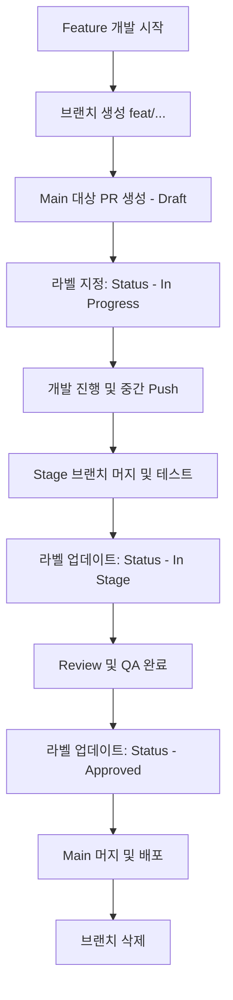
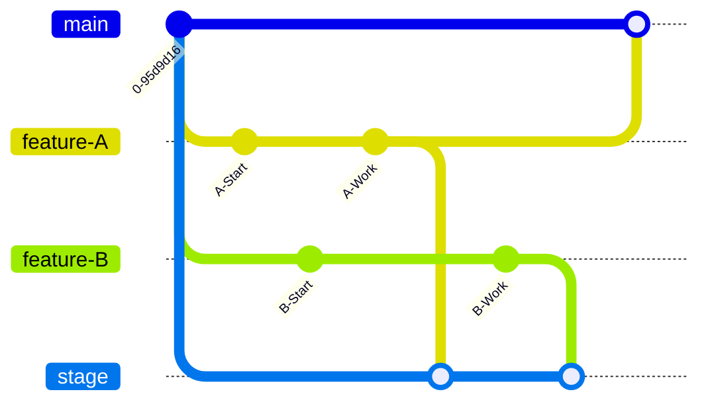

# 복잡한 브랜치 환경을 다스리는 비법: Main PR 선발행과 라벨 관리

개발 팀의 규모가 커지고 기능 개발이 활발해질수록 `feature/*`, `hotfix/*` 브랜치는 기하급수적으로 늘어납니다. 어느 순간 우리는 이런 질문에 직면하게 됩니다.

> "이 기능은 지금 어디까지 코딩됐나요?"
> "어떤 브랜치가 현재 스테이징에서 테스트 중이고, 이번 주 배포에 포함되는 건 무엇인가요?"

단순히 브랜치 목록만 봐서는 알 수 없는 프로젝트의 **'현재 상태'**를 명확하게 추적하기 위한 효과적인 브랜치 관리 전략을 공유합니다.

---

## 1. 핵심 아이디어: "메인 PR은 일찍 칠수록 좋다"

보통 PR(Pull Request)은 개발이 '완료'된 시점에 생성하는 것이 관례입니다. 하지만 우리가 제안하는 방식은 **개발 시작과 동시에, 혹은 초기 커밋 직후에 `main` 브랜치를 대상으로 PR을 미리 생성**하는 것입니다.

### 왜 `main` 대상 PR인가?
단순히 코드를 합치는 용도가 아니라, 해당 기능의 **'생존 신고'와 '진척도 대시보드'** 역할을 수행하기 때문입니다.

1. **가시성 확보**: 현재 어떤 작업들이 진행 중인지 모든 팀원이 알 수 있습니다.
2. **리뷰의 일상화**: 코드가 완성되기 전에도 동료들이 방향성을 미리 파악하고 피드백을 줄 수 있습니다. (Draft PR 활용)
3. **히스토리 추적**: 해당 기능이 어떤 논의를 거쳐 `main`까지 도달했는지 단일 PR 내에 모든 기록이 남습니다.

---

## 2. 워크플로우 시각화

새로운 기능이 `main` 브랜치에 도달하기까지의 과정을 Mermaid 다이어그램으로 살펴보겠습니다.

### 기능 개발의 전체 생명주기

### 브랜치 병렬 운영 예시

여러 기능이 동시에 개발될 때, `main` PR은 각각 살아남아 배포 시점을 기다립니다.

---

## 3. GitHub Label을 활용한 상태 관리

PR만 미리 생성한다고 해서 정리가 끝나는 것은 아닙니다. 핵심은 **라벨(Label)** 을 통한 체계적인 분류입니다.

### 3.1. 작업 성격 분류 (Category)
- `type: feature`: 새로운 기능 추가
- `type: bugfix`: 버그 수정
- `type: refactor`: 코드 개선

### 3.2. 진행 상태 (Progress)
- `Status: In Progress`: 현재 로컬에서 개발 중인 상태
- `Status: In Stage`: Stage 환경에 머지되어 테스트/검증 중인 상태
- `Status: Approved`: 모든 검증 완료, Main 배포 대기 상태
- `Status: On Hold`: 기획 변경 등으로 인해 작업이 일시 중단된 상태

### 3.3. 우선순위 (Priority)
- `P0 - Critical`: 즉시 배포 필요 (Hotfix)
- `P1 - High`: 이번 스프린트 내 완료 필수
- `P2 - Normal`: 일반적인 개발 작업

---

## 4. 이 전략의 실제 효과

### 협업 효율성 증대
PM이나 기획자가 "이거 언제 배포돼요?"라고 물어볼 필요가 없습니다. GitHub PR 목록에서 `Status: Approved` 라벨이 붙은 항목들만 필터링하면 이번 배포 예정 레이아웃이 한눈에 나옵니다.

### 배포 선별의 유연성
여러 기능이 `stage` 브랜치에 뒤섞여 있어도 상관없습니다. 배포 시점에는 `main`을 향해 열려 있는 개별 PR들 중 `Approved`된 것만 골라서 `main`에 머지하면 됩니다.

### 노션(Notion)과의 연동
GitHub PR 링크를 노션에 붙여넣기(`미리보기` 모드) 하면, 노션 페이지 내에서도 PR의 라벨 상태가 실시간으로 반영됩니다. 개발 상황을 보고하기 위한 별도의 문서 작업이 획기적으로 줄어듭니다.

---

## 5. 마치며

도구는 관리하기 나름입니다. Git 브랜치 관리가 단순히 "코드를 합치는 행위"를 넘어 "**프로젝트의 흐름을 관리하는 투명한 창**"이 될 수 있도록 `Main PR 선발행` 전략을 팀에 도입해 보는 것은 어떨까요?

처음에는 PR을 미리 만드는 것이 낯설 수 있지만, 한 번 익숙해지면 수십 개의 브랜치 사이에서도 평온함을 찾을 수 있을 것입니다.
