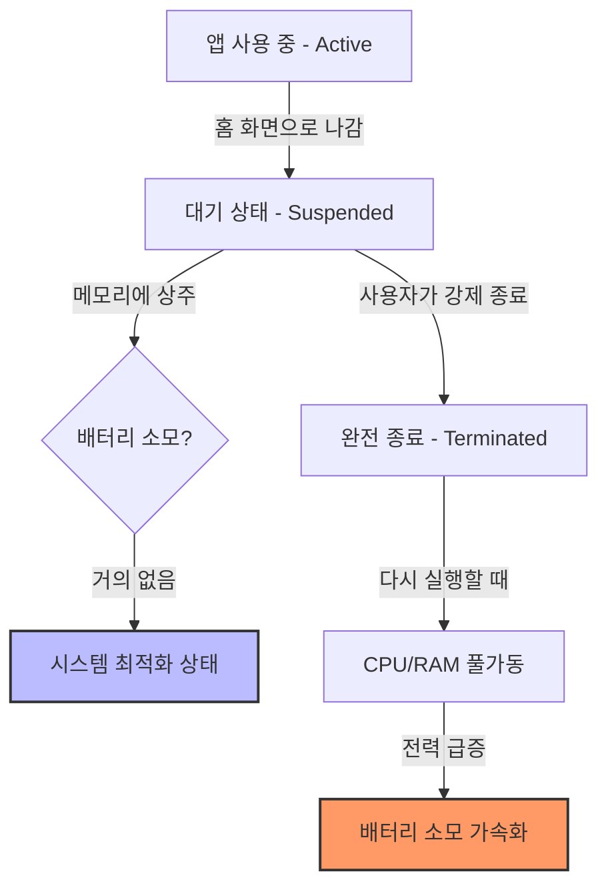
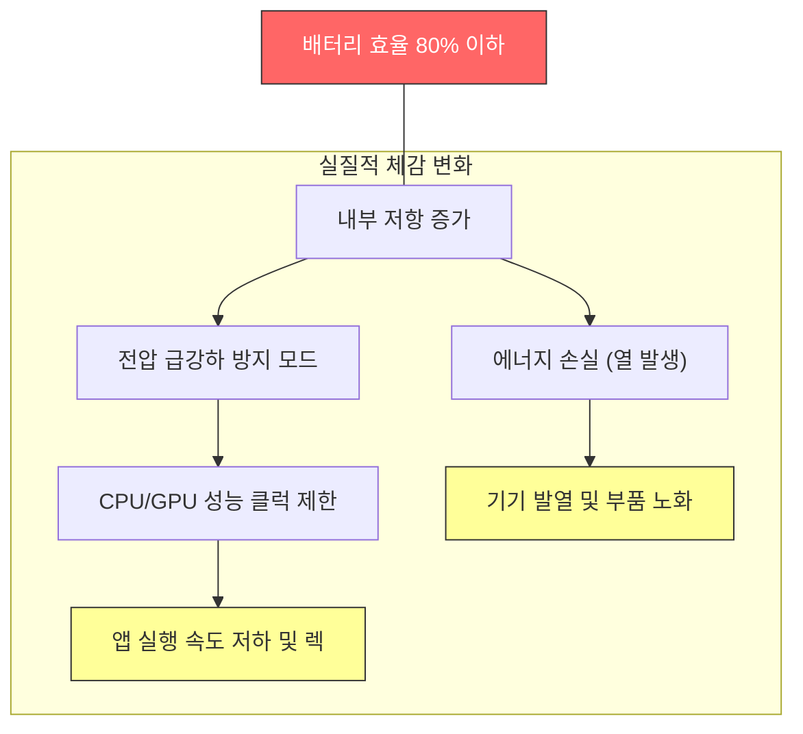

애플 스토어를 방문했다가 종종 의외의 답변을 들었다는 분들이 많습니다. "배터리를 교체하기보다는 보조배터리를 쓰세요", 혹은 "배터리를 아끼려면 앱 사용 후 바로 백그라운드에서 지우세요" 같은 조언들 말이죠. 

결론부터 말씀드리면, **이 조언은 반은 맞고 반은 틀렸습니다.** 2026년 현재, 최신 iOS 26 환경에서 우리가 알아야 할 진짜 배터리 관리법을 정리해 드립니다.

## 1. 앱 강제 종료(Swipe up), 오히려 독이 되는 이유

많은 분이 앱을 사용한 뒤 위로 쓸어올려 종료하면 배터리가 절약된다고 믿습니다. 하지만 이는 iOS의 멀티태스킹 동작 원리를 오해한 것입니다. 아래 다이어그램을 통해 앱이 종료될 때 어떤 일이 벌어지는지 확인해 보세요.

* **동결(Frozen) 상태:** iOS에서 백그라운드에 있는 앱은 대부분 '동결' 상태로 메모리에 상주합니다. CPU 자원을 거의 쓰지 않으며 배터리 소모도 미미합니다.
* **재실행의 대가:** 앱을 강제로 종료했다가 다시 켤 때, 시스템은 플래시 메모리에서 데이터를 다시 읽어오고 CPU를 풀가동해야 합니다. 이 과정에서 발생하는 전력 소모가 백그라운드에 가만히 놔두는 것보다 훨씬 큽니다.

> **결론:** 앱이 먹통이 되었을 때만 강제 종료하세요. 평소에는 그냥 두는 것이 배터리와 성능 모두에 이득입니다.

---

## 2. 배터리 성능 80% 이하, 왜 교체가 답인가?

테크니션이 "보조배터리가 더 저렴하다"며 교체를 만류했다면, 이는 사용자 경험(UX)을 간과한 조언입니다. 배터리 효율이 80% 미만으로 떨어지면 단순한 조기 방전 이상의 **'성능 저하의 굴레'**에 빠지게 됩니다.

* **피크 성능 저하 (Throttling):** iOS는 배터리 전압이 불안정해지면 기기가 갑자기 꺼지는 것을 막기 위해 CPU 속도를 강제로 제한합니다. 폰이 버벅거리기 시작하는 주원인입니다.
* **발열 가속화:** 효율이 낮은 배터리는 충전 및 사용 시 저항이 높아져 열이 더 많이 발생합니다. 발열은 다시 배터리 수명을 갉아먹는 악순환을 만듭니다.

**iOS 26에서의 기대 효과:**
배터리 교체 시, 최신 뉴럴 엔진(Neural Engine)의 연산 속도가 정상화되며 시스템 애니메이션이 다시 부드러워집니다. 보조배터리는 '전원'을 공급할 뿐, '성능'을 복구해주지 않습니다.

---

## 3. iOS 26에서 실질적으로 효과 있는 절약 팁

근거 없는 미신 대신, 애플 엔지니어링 문서와 실험으로 증명된 방법들입니다.

| 구분 | 추천 습관 | 효과 |
| --- | --- | --- |
| **디스플레이** | 다크 모드 활성화 | OLED 소자 전력 차단 (실질적 효과) |
| **설정** | 백그라운드 앱 새로고침 선별 | 불필요한 데이터 통신 차단 |
| **환경** | 고온 노출 방지 | 배터리 화학적 노화 방지 (가장 중요) |
| **충전** | 최적화된 배터리 충전 사용 | 80% 이상 구간 부하 감소 |

### ❌ 무시해도 되는 것

* **Wi-Fi/블루투스 끄기:** 현대의 저전력 블루투스(BLE)는 배터리 소모량이 극히 적습니다. 오히려 이걸 끄느라 제어 센터를 들락날락하는 화면 켜짐 시간이 더 아깝습니다.

---

## 마치며

배터리는 소모품입니다. 80% 이하로 떨어진 성능을 소프트웨어 최적화나 보조배터리로 메우는 것은 한계가 있습니다. 잘못된 관리 습관으로 스트레스받기보다는, 올바른 지식으로 기기를 쾌적하게 사용하는 것이 가장 스마트한 방법입니다.

