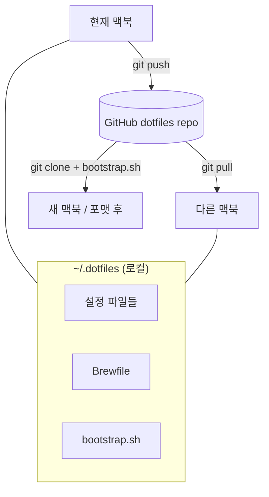

새 맥북을 받거나 OS를 포맷하고 나서 환경 세팅에 반나절을 쓴 적이 있다면, 이 글이 도움이 될 겁니다.

핵심 아이디어는 간단합니다. **홈 디렉터리에 흩어진 설정 파일들을 Git 리포지터리 하나로 관리하고, 새 맥에서는 그걸 클론해서 자동으로 연결**하는 것입니다. 한 번만 제대로 세팅해두면 이후엔 맥북이 몇 대든, 포맷을 몇 번 하든 같은 환경을 10분 안에 복원할 수 있습니다.

---

## 이 글에서 다루는 내용

- dotfiles가 무엇이고 왜 관리해야 하는지
- GNU Stow로 symlink를 깔끔하게 관리하는 방법
- Homebrew Brewfile로 앱과 툴을 통째로 백업/복원하는 방법
- 새 맥북에서 한 번에 환경을 구축하는 `bootstrap.sh` 작성
- 민감한 정보를 안전하게 분리하는 방법

---

## dotfiles란?

macOS(그리고 Linux)에서 `.zshrc`, `.gitconfig`, `.vimrc`처럼 이름이 `.`으로 시작하는 파일들을 **dotfiles**라고 부릅니다. 이 파일들에는 여러분의 터미널 테마, 단축키, Git 별칭, 에디터 설정 등 수년간 쌓인 개인 설정이 담겨 있습니다.

문제는 이 파일들이 `~` (홈 디렉터리) 여기저기에 흩어져 있어서, 새 맥을 세팅할 때마다 기억에 의존해 하나씩 다시 만들어야 한다는 겁니다.

---

## 전체 흐름



---

## Step 1. ~/.dotfiles 디렉터리 만들기

먼저 모든 설정을 모아둘 디렉터리를 만들고, Git 리포지터리로 초기화합니다.

```bash
mkdir -p ~/.dotfiles
cd ~/.dotfiles
git init
git remote add origin https://github.com/yourusername/dotfiles.git
```

> GitHub에서 `dotfiles`라는 이름으로 **비공개(private)** 리포지터리를 먼저 만들어두세요. 설정 파일에는 개인 정보가 담길 수 있으므로 공개 리포는 신중하게 결정하세요.

---

## Step 2. 설정 파일을 dotfiles로 이동하기

홈 디렉터리에 있는 설정 파일들을 `~/.dotfiles` 안으로 옮깁니다. 디렉터리 구조는 홈 디렉터리를 기준으로 맞춥니다.

```bash
# 예시: zsh 설정
mkdir -p ~/.dotfiles/zsh
mv ~/.zshrc ~/.dotfiles/zsh/.zshrc

# git 설정
mkdir -p ~/.dotfiles/git
mv ~/.gitconfig ~/.dotfiles/git/.gitconfig
```

결과적으로 이런 구조가 됩니다.

```
~/.dotfiles/
├── zsh/
│   ├── .zshrc
│   └── .zprofile
├── git/
│   ├── .gitconfig
│   └── .gitignore_global
├── vim/
│   └── .vimrc
├── ssh/
│   └── .ssh/
│       └── config          ← 키 파일은 절대 여기 넣지 말 것
├── Brewfile
└── bootstrap.sh
```

---

## Step 3. GNU Stow로 symlink 자동 관리

파일을 옮겼으니, 원래 위치(`~/`)에 심볼릭 링크를 만들어줘야 각 프로그램이 설정을 인식할 수 있습니다. **GNU Stow**가 이 작업을 패키지 단위로 자동화해줍니다.

```bash
brew install stow
```

`~/.dotfiles` 안에서 패키지 이름(디렉터리명)을 지정해 실행하면, 해당 디렉터리 안의 파일들을 홈 디렉터리에 symlink로 연결합니다.

```bash
cd ~/.dotfiles
stow zsh   # ~/.zshrc → ~/.dotfiles/zsh/.zshrc
stow git   # ~/.gitconfig → ~/.dotfiles/git/.gitconfig
stow vim   # ~/.vimrc → ~/.dotfiles/vim/.vimrc
```

여러 패키지를 한 번에 연결할 수도 있습니다.

```bash
stow zsh git vim
```

이제부터 `~/.zshrc`를 수정하는 것은 `~/.dotfiles/zsh/.zshrc`를 수정하는 것과 같습니다. 수정 후 `git push`만 하면 됩니다.

---

## Step 4. Brewfile로 앱·툴 목록 관리

Homebrew의 `bundle` 기능을 사용하면 현재 설치된 모든 CLI 툴, GUI 앱(Cask), Mac App Store 앱을 `Brewfile`이라는 파일 하나에 담을 수 있습니다.

### 현재 환경 스냅샷 만들기

```bash
brew bundle dump --file=~/.dotfiles/Brewfile --force
```

`Brewfile`은 이런 모습입니다.

```ruby
tap "homebrew/bundle"

brew "git"
brew "zsh"
brew "stow"
brew "fzf"
brew "ripgrep"
brew "starship"

cask "iterm2"
cask "visual-studio-code"
cask "docker"
cask "raycast"

mas "Xcode", id: 497799835
```

### 다른 맥에서 복원하기

```bash
brew bundle install --file=~/.dotfiles/Brewfile
```

이 한 줄이 `Brewfile`에 적힌 모든 것을 설치합니다.

---

## Step 5. bootstrap.sh — 새 맥북 원클릭 세팅

지금까지 만든 것들을 하나의 스크립트로 묶습니다. 새 맥북이나 포맷 후에는 이 스크립트 하나만 실행하면 됩니다.

```bash
#!/bin/bash
set -e

echo "🚀 개발 환경 세팅 시작..."

# 1. Homebrew 설치 (이미 설치된 경우 스킵)
if ! command -v brew &>/dev/null; then
  echo "📦 Homebrew 설치 중..."
  /bin/bash -c "$(curl -fsSL https://raw.githubusercontent.com/Homebrew/install/HEAD/install.sh)"
fi

# Apple Silicon: Homebrew PATH 설정
eval "$(/opt/homebrew/bin/brew shellenv)"

# 2. dotfiles 클론
echo "📂 dotfiles 클론 중..."
if [ ! -d "$HOME/.dotfiles" ]; then
  git clone https://github.com/yourusername/dotfiles.git ~/.dotfiles
fi

cd ~/.dotfiles

# 3. Brewfile로 앱·툴 설치
echo "🍺 Homebrew 패키지 설치 중..."
brew bundle install

# 4. GNU Stow 설치 확인 후 심링크 연결
echo "🔗 설정 파일 심링크 연결 중..."
brew install stow
stow zsh git vim ssh

echo "✅ 완료! 터미널을 재시작해주세요."
```

### 실행 방법

새 맥에서는 터미널을 열고 아래 명령 하나만 입력하면 됩니다.

```bash
/bin/bash -c "$(curl -fsSL https://raw.githubusercontent.com/yourusername/dotfiles/main/bootstrap.sh)"
```

---

## Step 6. Apple Silicon 환경에서 알아둘 것

M1, M2, M3, M4 등 Apple Silicon 맥은 모두 Homebrew 경로가 동일합니다.

```zsh
# ~/.zshrc 또는 ~/.zprofile
# Apple Silicon (M1/M2/M3/M4 공통)
eval "$(/opt/homebrew/bin/brew shellenv)"
```


Intel Mac(`/usr/local/bin/brew`)과 함께 쓸 일이 있다면 `uname -m`으로 분기할 수 있지만, Apple Silicon만 쓴다면 위의 한 줄이 가장 깔끔합니다.


---

## Step 7. 민감한 정보 분리하기

API 키, SSH 비밀 키, 회사 계정 정보 같은 민감한 데이터는 절대 dotfiles 리포지터리에 넣으면 안 됩니다.

### 권장 패턴: .zshrc.local 분리

```zsh
# ~/.dotfiles/zsh/.zshrc 맨 아래에 추가
# 민감한 설정은 별도 파일에서 불러옴 (Git에 포함되지 않음)
[ -f ~/.zshrc.local ] && source ~/.zshrc.local
```

`~/.zshrc.local`은 각 맥에서 직접 만들고, `.gitignore`에 추가합니다.

```bash
# ~/.dotfiles/.gitignore
.zshrc.local
.env
*.pem
*.key
```

### SSH 키 관리

SSH 키 파일 자체는 Git에 넣지 말고, `~/.ssh/config`만 관리하세요.

```
# ~/.dotfiles/ssh/.ssh/config
Host github.com
  IdentityFile ~/.ssh/id_ed25519
  AddKeysToAgent yes
  UseKeychain yes
```

실제 키 파일은 Time Machine 백업이나 1Password 같은 별도 수단으로 관리합니다.

---

## 일상적인 워크플로우

dotfiles를 세팅한 후의 일상은 이렇게 됩니다.


두 맥 사이의 설정 동기화는 `git pull` 한 번으로 끝납니다. 새 툴을 설치했다면:

```bash
# 새 툴 설치 후 Brewfile 업데이트
brew bundle dump --file=~/.dotfiles/Brewfile --force
cd ~/.dotfiles && git add Brewfile && git commit -m "add: [툴 이름]" && git push
```

---

## 추천 추가 도구

| 도구 | 용도 | 비고 |
|---|---|---|
| **starship** | 빠르고 예쁜 쉘 프롬프트 | Rust 기반, 설정도 dotfiles로 관리 |
| **mackup** | VS Code, iTerm2 등 앱 설정 백업 | iCloud/Dropbox 활용 |
| **chezmoi** | Stow 대안, 암호화 및 템플릿 지원 | 더 복잡한 멀티 환경에 유리 |
| **1Password CLI** | 비밀 키·토큰을 쉘에서 안전하게 주입 | `op run` 명령으로 환경변수 주입 |

---

## 마치며

처음 세팅하는 데 한 시간 정도 걸리지만, 그 이후로는 새 맥북이나 포맷이 더 이상 두렵지 않습니다. 무엇보다 수년간 쌓은 나만의 설정이 Git 히스토리로 남아 언제든 되돌리거나 비교할 수 있다는 것이 큰 장점입니다.

지금 당장 `~/.zshrc`를 `~/.dotfiles`로 옮기는 것부터 시작해보세요.
