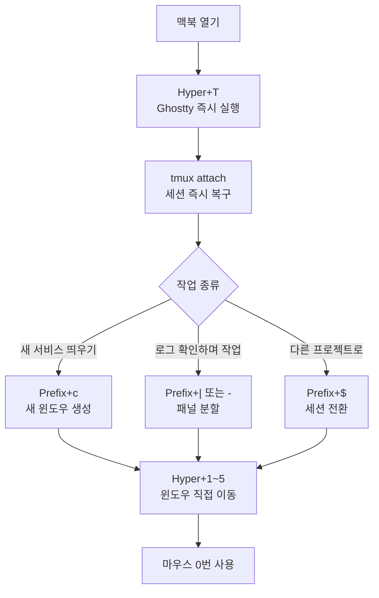

> Frontend, Backend, Infrastructure를 동시에 다루는 요즘 엔지니어에게 터미널은 단순한 입력창이 아니다. 세 도구를 유기적으로 연결하면 맥락 전환 비용이 거의 사라진다.

## 이 글에서 다루는 내용

- Ghostty를 선택한 이유와 핵심 설정
- tmux로 프로젝트 세션을 분리하고 상태를 보존하는 방법
- Karabiner Hyper Key로 터미널 전용 단축키 레이어 만들기
- 세 도구를 묶은 실전 워크플로우

---

## Ghostty — 렌더링부터 다시 생각한 터미널

터미널 에뮬레이터 선택지는 많다. iTerm2, Alacritty, WezTerm... 그런데 최근 가장 빠르게 주목받고 있는 건 **Ghostty**다.

Ghostty는 Zig로 작성되어 Metal API를 직접 활용해 렌더링한다. 수천 줄의 로그가 쏟아지는 상황에서도 프레임 드랍이 거의 없다. 그러면서도 macOS 네이티브 창 장식(둥근 모서리, 블러 효과)을 완벽하게 지원하는 게 특징이다. 성능과 감성 두 마리 토끼를 동시에 잡은 셈이다.

설정 파일은 텍스트 하나로 끝난다.

```text
# ~/.config/ghostty/config

font-family = "JetBrainsMono Nerd Font"
font-size = 13

# left Option을 Alt로 인식 (tmux, vim 단축키 충돌 방지)
macos-option-as-alt = left

# macOS 네이티브 창 장식 사용
window-decoration = true

# 탭바 숨김 (tmux로 탭 관리하므로 불필요)
macos-titlebar-style = hidden
```

`macos-option-as-alt = left` 설정은 중요하다. macOS는 기본적으로 `Option` 키를 특수문자 입력에 사용하는데, 이를 그대로 두면 tmux나 vim에서 `Alt` 조합 단축키가 동작하지 않는다. `left`로 설정하면 왼쪽 Option만 Alt로 인식하고, 오른쪽 Option은 기존 macOS 특수문자 입력에 그대로 쓸 수 있다.


JetBrains Mono Nerd Font가 없다면 `brew install --cask font-jetbrains-mono-nerd-font`로 설치할 수 있다.


---

## tmux — 터미널의 '상태'를 보존하다

MSA 환경에서 작업하다 보면 터미널 창이 감당이 안 될 정도로 늘어난다. Spring Boot 로그, 프론트엔드 dev 서버, Terraform plan, DB 모니터링... tmux는 이 복잡한 맥락을 세션 단위로 박제해준다.

맥북을 닫았다 열어도, 터미널을 실수로 껐다 켜도 `tmux attach` 한 번으로 모든 게 그대로다.

### 세션 구조 설계

```text
tmux
├── session: work
│   ├── window 1: api      (Spring Boot 서버 + 로그)
│   ├── window 2: front    (Vite dev server)
│   └── window 3: git      (git 작업 전용)
├── session: infra
│   ├── window 1: tf       (Terraform)
│   └── window 2: docker   (Docker compose 로그)
└── session: blog
    └── window 1: 11ty     (로컬 블로그 서버)
```

세션을 프로젝트 단위로 분리하면 컨텍스트 스위칭 비용이 확 줄어든다.

### prefix 키 재매핑 — Ctrl+b는 너무 멀다

tmux 기본 prefix는 `Ctrl+b`다. 하지만 `b`는 키보드 왼쪽 아래에 있어서 `Ctrl`과 조합하면 손이 꽤 많이 꺾인다. 대부분의 tmux 사용자가 가장 먼저 바꾸는 설정이다.

```bash
# ~/.tmux.conf

# prefix를 Ctrl+a로 변경 (screen 스타일, 왼쪽 새끼손가락 조합)
unbind C-b
set-option -g prefix C-a
bind-key C-a send-prefix

# 패널 분할 키를 직관적으로
bind | split-window -h -c "#{pane_current_path}"
bind - split-window -v -c "#{pane_current_path}"
unbind '"'
unbind %

# 패널 간 이동을 vim 방향키로
bind h select-pane -L
bind j select-pane -D
bind k select-pane -U
bind l select-pane -R

# 설정 즉시 리로드
bind r source-file ~/.tmux.conf \; display "tmux.conf reloaded!"

# 마우스 지원 (가끔 쓸 때)
set -g mouse on

# 창 번호를 1부터 시작 (0은 키보드 오른쪽 끝이라 불편)
set -g base-index 1
setw -g pane-base-index 1
```

`Ctrl+a`는 터미널에서 줄 맨 앞으로 이동하는 기본 단축키(`readline`)이기도 하다. prefix로 가로채게 되면 이 기능이 막히는데, 위 설정의 `bind-key C-a send-prefix`가 `Ctrl+a`를 두 번 누르면 원래 동작을 하도록 우회해준다.

### 자주 쓰는 tmux 단축키

| 단축키 | 동작 |
|---|---|
| `Prefix + c` | 새 윈도우 |
| `Prefix + 1~9` | 해당 번호 윈도우로 이동 |
| `Prefix + n / p` | 다음 / 이전 윈도우 |
| `Prefix + ,` | 현재 윈도우 이름 변경 |
| `Prefix + d` | 세션 detach |
| `Prefix + \|` | 수직 분할 |
| `Prefix + -` | 수평 분할 |
| `Prefix + h/j/k/l` | 패널 이동 |
| `Prefix + z` | 현재 패널 최대화 (토글) |

---

## Karabiner — 세 도구를 하나로 묶는 다리

Ghostty와 tmux를 각각 잘 쓰는 것만으로도 충분히 강력하다. 여기에 Karabiner를 더하면 **어느 앱에서든 터미널로 즉시 복귀**하고, **tmux 윈도우를 키보드 하나로 직접 이동**할 수 있는 레이어가 생긴다.

### Caps Lock → Hyper Key

2편(Karabiner 완전 정복기)에서 자세히 다뤘지만, 핵심만 짚으면 이렇다.

- `Caps Lock` **단독 탭** → `F18` (한/영 전환 또는 Escape)
- `Caps Lock` + **다른 키** → `⌃⌥⌘⇧` (Hyper Key)

`⌃⌥⌘⇧` 조합은 다른 앱과 충돌할 일이 없어서 완전히 빈 단축키 레이어가 된다.

### 터미널 전용 단축키 레이어

```json
// ~/.config/karabiner/assets/complex_modifications/terminal_layer.json
{
  "title": "Terminal Layer",
  "rules": [
    {
      "description": "Hyper+T: Ghostty 즉시 실행/전환",
      "manipulators": [
        {
          "type": "basic",
          "from": {
            "key_code": "t",
            "modifiers": {
              "mandatory": ["left_shift", "left_command", "left_control", "left_option"]
            }
          },
          "to": [
            {
              "shell_command": "open -a Ghostty"
            }
          ]
        }
      ]
    },
    {
      "description": "Hyper+1~5: tmux 윈도우 직접 이동 (send-keys로 전달)",
      "manipulators": [
        {
          "type": "basic",
          "from": {
            "key_code": "1",
            "modifiers": {
              "mandatory": ["left_shift", "left_command", "left_control", "left_option"]
            }
          },
          "to": [
            {
              "shell_command": "/usr/local/bin/tmux select-window -t 1"
            }
          ],
          "conditions": [
            {
              "type": "frontmost_application_if",
              "bundle_identifiers": ["^com\\.mitchellh\\.ghostty$"]
            }
          ]
        }
      ]
    }
  ]
}
```

`Hyper + 1~5`는 Ghostty가 포커스됐을 때만 동작하도록 `frontmost_application_if` 조건을 걸어뒀다. 다른 앱에서 `Hyper + 1`을 눌러도 tmux 명령이 실행되지 않는다.

---

## 세 도구가 묶인 실전 워크플로우



아침 업무 시작부터 마무리까지 흐름을 정리하면 이렇다.

1. **맥북을 연다** → `Hyper + T`로 Ghostty 바로 진입. Spotlight나 Dock을 거치지 않는다.
2. **`tmux attach`** 한 번으로 어제 퇴근할 때 상태 그대로 복구. 서버 로그, Git 창, DB 모니터링이 전부 살아있다.
3. **Backend 로직 수정 중 Git 커밋이 필요하면** `Prefix + c`로 새 윈도우를 열어 커밋하고, `Hyper + 이전 윈도우 번호`로 즉시 복귀.
4. **다른 프로젝트로 전환할 때는** `Prefix + $`로 세션 전환. 전혀 다른 컨텍스트가 깔끔하게 분리돼있다.

이 모든 과정에서 마우스를 한 번도 쓰지 않는다.

---

## 마치며

도구는 거들 뿐이지만, 잘 정돈된 도구는 엔지니어의 사고 흐름을 끊지 않는다. Ghostty가 렌더링 병목을 없애고, tmux가 컨텍스트를 보존하고, Karabiner가 둘 사이의 이동 비용을 0에 가깝게 만든다. 세 도구가 제 역할을 분담하면서 하나처럼 동작하는 게 이 세팅의 핵심이다.

다음 편에서는 실제로 사용하는 `tmux.conf` 전체 설정과 Karabiner JSON 파일을 통째로 공유한다. 테마, 상태바 구성, 세션 자동화 스크립트까지 더할 예정이다.

---

**다음 편:**

- [tmux.conf 전체 공개 + Karabiner JSON 실전 세팅](/posts/2026/tmux-conf-karabiner-json-full-setup)
