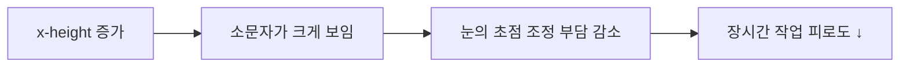
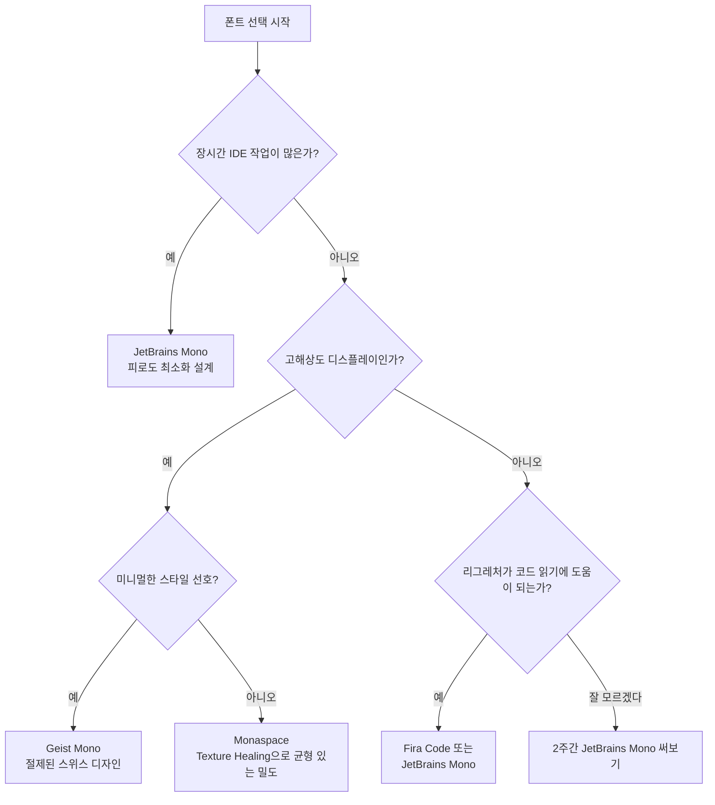

> 터미널에 폰트 하나 바꿨을 뿐인데 코드가 다르게 읽힌다면, 그건 기분 탓이 아닙니다.

## 이 글에서 다루는 내용

- 코딩 폰트의 역사를 이끈 레거시 폰트들이 해결하려 했던 문제
- 리그레처(Ligature)가 코드 읽기 방식을 어떻게 바꿨는지
- JetBrains Mono가 '과학적으로' 피로도를 줄이는 원리
- Monaspace의 Texture Healing이 80년 묵은 고정폭의 한계를 깬 방식
- 고해상도 시대의 미니멀리스트, Geist Mono
- 내 환경에 맞는 폰트를 고르는 기준

---

## 레거시의 시대: '구분'이 곧 생산성이었던 시절

코딩 폰트의 첫 번째 과제는 한 가지였습니다. **숫자 `1`, 소문자 `l`, 대문자 `I`를 헷갈리지 않게 보여주는 것.**

저해상도 CRT 모니터 앞에서 하루 종일 코드를 들여다보던 시절, 이 세 글자의 구분이 흐려지면 버그 하나를 추적하는 데 한 시간을 날릴 수도 있었습니다. 이 시절을 지배한 폰트들이 바로 **DejaVu Sans Mono**와 **Consolas**입니다.

**DejaVu Sans Mono**는 Bitstream Vera를 이어받아 오픈소스 진영의 사실상 표준이 됐습니다. 넓은 자간과 또렷한 획 덕분에 어떤 환경에서도 믿음직스러운 가독성을 보장했죠. **Consolas**는 Windows 개발 환경의 교과서였습니다. 균형 잡힌 비율로 Visual Studio와 함께 수많은 개발자의 눈을 책임졌습니다.

한국에서는 **D2Coding**이 이 역할을 맡았습니다. 한글 주석이 섞인 코드 파일에서도 영문 코드와 한글이 자연스럽게 어우러지도록 설계된, 국내 환경에 최적화된 선택지였습니다.

이 폰트들의 목표는 단 하나, **오독 방지**였습니다. 이 시대에 "좋은 코딩 폰트"의 기준은 그게 전부였습니다.

---

## 리그레처의 등장: 기호가 문법이 되는 순간

2014년 **Fira Code**가 등장하면서 코딩 폰트의 패러다임이 조용히 뒤집혔습니다.

핵심은 **리그레처(Ligature, 합자)** 였습니다. 두 개 이상의 글자를 하나의 시각적 단위로 합쳐 표현하는 기법인데, 코드에 적용하면 이렇습니다.

| 타이핑하는 것 | 폰트가 보여주는 것 | 의미 |
|---|---|---|
| `!=` | `≠` | 같지 않다 |
| `=>` | `→` | 화살표 (람다, 맵) |
| `<=` | `≤` | 이하 |
| `===` | `≡` | 엄격한 동등 |
| `//` | 수직으로 합쳐진 슬래시 | 주석 |

실제로 파일에 저장되는 문자는 여전히 `!`와 `=`입니다. 폰트가 렌더링 단계에서만 이걸 합쳐서 보여주는 겁니다. 코드 자체는 바뀌지 않습니다.

효과는 미묘하지만 실질적입니다. 뇌가 `!=`를 '느낌표 다음 등호'로 순차 해독하는 대신, `≠`라는 하나의 수학적 개념으로 즉시 처리합니다. 빠른 코드 스캔, 특히 비교 연산이 많은 조건문을 읽을 때 체감이 납니다.

물론 취향은 갈립니다. "화면에 보이는 게 실제 코드가 아니다"는 불편함을 느끼는 개발자도 많고, 팀 내 규칙으로 리그레처를 금지하는 곳도 있습니다. 지금은 선택의 문제지만, 리그레처가 현대 코딩 폰트의 필수 요소로 자리잡은 건 사실입니다.

---

## JetBrains Mono: 피로도를 설계로 푸는 법

현재 가장 많은 개발자가 사용하는 코딩 폰트를 꼽으라면 **JetBrains Mono**가 빠지지 않습니다. IDE 회사가 만든 폰트답게, 단순히 보기 좋게 만드는 데서 끝나지 않았습니다.

핵심 설계 원칙은 **x-height 확장**입니다. x-height란 소문자의 높이를 말합니다. JetBrains Mono는 이 소문자 높이를 의도적으로 키웠습니다. 같은 폰트 크기라도 텍스트가 더 크게 느껴지는 이유가 여기에 있습니다. 줄 간격은 유지하면서 글자 자체만 커 보이게 하면, 눈이 포커싱하는 데 쓰는 에너지가 줄어듭니다.

수만 줄의 코드를 매일 들여다봐야 하는 IntelliJ, WebStorm, GoLand 사용자들의 피드백이 녹아든 결과입니다. "장시간 써도 눈이 덜 피로하다"는 평가가 인기의 핵심 이유 중 하나입니다.

---

## Monaspace: 80년 된 고정폭의 한계를 기술로 깨다

2026년 기준으로 코딩 폰트 씬에서 가장 흥미로운 이야기는 GitHub이 발표한 **Monaspace**에서 나옵니다.

먼저 고정폭(Monospace) 폰트가 왜 필요한지부터. 코드 편집기는 들여쓰기와 세로 정렬에 의존합니다. 가변폭 폰트를 쓰면 `i`와 `m`의 너비가 달라져 세로 줄이 들쭉날쭉 무너집니다. 그래서 1940년대 타자기 시절부터 이어진 원칙, "모든 글자는 같은 너비"가 코딩 폰트를 지배해 왔습니다.

문제는 이 원칙이 가져오는 시각적 불균형입니다.

- `m`, `w`처럼 원래 넓어야 할 글자 → 강제로 압축되어 답답하게 보임
- `i`, `l`, `1`처럼 원래 좁아야 할 글자 → 양옆이 비어 휑하게 보임

**Texture Healing**은 이 문제를 격자 구조를 유지하면서 우회하는 방식입니다. 각 글자가 차지하는 '칸'의 수는 같지만, 렌더링 시 주변 글자와 공간을 미세하게 나눠 씁니다. `m`은 조금 넓게, `i`는 조금 좁게, 시각적 밀도가 균등해집니다.

결과적으로 **격자 정렬은 유지하면서, 읽을 때는 가변폭 폰트처럼 매끄럽게** 흐릅니다. 글자들이 서로 "숨을 맞춘다"는 표현이 어울립니다.


Monaspace는 Argon, Neon, Xenon, Radon, Krypton 다섯 가지 서체 변형을 포함합니다. 각각 세리프 유무, 획의 성격이 다르므로 코드 외에 마크다운 문서 작업 등에서 서체를 섞어 쓰는 것도 가능합니다.


---

## Geist Mono: 고해상도 시대의 미니멀리스트

Vercel이 설계하고 2023년 공개한 **Geist Mono**는 다른 접근을 취합니다. 기술적 혁신보다 **시각적 절제**를 택했습니다.

스위스 국제 타이포그래피 양식(Swiss Design)의 영향을 받은 폰트답게, 불필요한 장식을 모두 걷어낸 형태입니다. 글자 하나하나가 군더더기 없이 딱 필요한 만큼만 표현됩니다.

이 스타일이 빛나는 환경은 **고해상도 레티나 디스플레이**입니다. 픽셀 밀도가 낮은 화면에서는 단순한 획이 오히려 밋밋하게 보일 수 있지만, Retina나 4K 환경에서는 정교한 곡선과 여백이 살아납니다.

| 조합 | 추천 이유 |
|---|---|
| Geist Mono + Ghostty | GPU 가속 렌더링과 정밀한 폰트 힌팅의 조합 |
| Geist Mono + Alacritty | 가벼운 터미널에서 폰트 자체의 존재감 |
| Geist Mono + VS Code | 다크 테마와 미니멀 UI에 자연스럽게 어울림 |

---

## 어떤 폰트를 선택해야 할까?

정답은 없습니다. 하지만 선택 기준은 있습니다.

한 가지 팁: 폰트를 바꾸면 처음 며칠은 어색합니다. 적어도 **1~2주는 써봐야** 실제로 맞는지 판단할 수 있습니다. 하루 쓰고 "뭔가 이상해서" 되돌아가는 건 반쯤 포기하는 겁니다.

---

## 마치며

코딩 폰트의 역사는 사실 개발 환경 자체의 역사이기도 합니다. 저해상도 모니터에서 시작해, 글자의 논리적 의미를 시각화하는 리그레처로, 그리고 80년 묵은 고정폭의 시각적 한계를 우회하는 Texture Healing까지.

변화의 방향은 하나입니다. 폰트가 코드의 **형태**를 보여주는 것을 넘어, 코드의 **의미**를 보조하는 도구가 되는 방향.

지금 쓰는 폰트가 오래됐다면, 오늘 하나 바꿔보세요. 아마 생각보다 빨리 이전 폰트로 돌아가기 싫어질 겁니다.

---


폰트를 바꾼 뒤 터미널 아이콘(``, ``, `` 등)이 □□□로 보인다면, [nerdfonts.com](https://www.nerdfonts.com)에서 Nerd Fonts 패치가 완료된 버전을 설치하세요. JetBrains Mono NF, Geist Mono NF 등 대부분의 주요 폰트가 패치 버전을 제공합니다.

