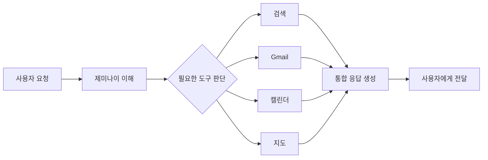

> 검색창 하나로 세상을 연결했던 회사가, 이제 AI로 세상과 대화한다.

## 이 글에서 다루는 내용

- 모두가 미쳤다고 했던 유튜브 인수, 지금은?
- 알파고와 이세돌: 전 세계가 멈춘 그 순간
- 구글의 리더들: 래리 페이지부터 순다르 피차이까지
- 제미나이가 구글의 미래인 이유
- 구글이 직면한 도전들

---

## 16억 5천만 달러의 도박

2006년, 구글이 유튜브를 인수하겠다고 발표했을 때 업계 반응은 냉담했다. 당시 유튜브는 설립된 지 1년도 안 된 적자 스타트업이었다. 저작권 소송에 시달리고 있었고, 서버 비용은 하늘을 찌르고 있었다. 그럼에도 구글은 16억 5천만 달러어치의 자사 주식을 내주고 유튜브를 인수했다.

당시 언론은 "구글이 왜 저 돈을 버렸냐"며 고개를 갸웃했다. 지금은? 유튜브는 전 인류의 TV가 됐다. 매달 20억 명 이상이 사용하는 세계 최대의 영상 플랫폼이 됐다. 인수가 발표됐던 그날, 구글 내부에서는 이미 10년 후를 보고 있었다.

비슷한 일이 Gmail 출시 전에도 있었다. Gmail 이전 세계에서 이메일 무료 용량의 표준은 수십 MB였다. 그런데 1GB를 무료로 주겠다고 하자 경쟁사들은 처음엔 비웃었다가, 몇 달 후 황급히 자신들의 용량을 수십 배씩 늘렸다. 구글이 기준을 바꿔버린 것이다.

---

## 크롬, 안드로이드: 인프라 전쟁

검색이 구글의 얼굴이라면, 크롬(Chrome)과 안드로이드(Android)는 구글의 뼈대다.

2008년 출시된 크롬 브라우저는 '빠름'이라는 단 하나의 무기로 등장했다. 당시 인터넷 익스플로러는 느리고 불안정했다. 파이어폭스가 대안으로 부상하던 시절이었다. 크롬은 이 모든 경쟁자들을 제치고 현재 전 세계 브라우저 시장의 65% 이상을 점유하는 표준이 됐다.

안드로이드는 더 극적인 이야기다. 구글은 2005년, 스마트폰이 세상을 지배하기 전에 안드로이드를 인수했다. 그리고 스마트폰 시대가 열리자 안드로이드를 무료 오픈소스로 공개하는 전략을 택했다. 결과적으로 전 세계 스마트폰의 70% 이상이 안드로이드를 탑재하게 됐다. 더 많은 사람이 더 많은 화면에서 구글을 쓰게 만드는, 장기적인 생태계 전략이었다.

---

## 알파고 쇼크: AI는 이미 와 있었다

2016년 3월. 서울 포시즌스 호텔 대회의실에서 구글 딥마인드(DeepMind)의 AI '알파고'와 바둑 세계 챔피언 이세돌 9단이 마주 앉았다. 전 세계 2억 명 이상이 생중계를 지켜봤다.

바둑은 체스와 달리 경우의 수가 우주의 원자 수보다 많다고 알려진 게임이다. AI가 수십 년 안에 인간 챔피언을 이기는 것은 불가능하다는 게 당시 학계의 중론이었다. 그런데 알파고가 이겼다. 4대 1로.

인류가 AI를 이론이 아닌 실체로 직면한 순간이었다. 그리고 그 충격의 진원지가 구글이 인수한 딥마인드였다는 사실이, 구글이 AI 분야에서 얼마나 먼 곳을 보고 있었는지를 증명했다.

---

## 구글의 세 리더

구글이라는 회사의 성격은 리더들을 통해 가장 잘 드러난다.

**래리 페이지 & 세르게이 브린**은 회사를 만든 사람들이다. 논문을 쓰다 세상을 바꿔버린 두 박사과정생. 두 사람은 초창기부터 "우리는 일반적인 회사가 되고 싶지 않다"는 말을 반복했다.  그 말은 허풍이 아니었다.

**에릭 슈미트(Eric Schmidt)** 는 2001년 영입된 전문 경영인이다. 당시 투자자들은 두 창업자에게 경험 있는 경영인이 필요하다고 압박했고, 슈미트는 이전에 노벨(Novell)의 CEO를 역임한 컴퓨터과학 박사였다.  그는 래리와 세르게이의 기술적 직관에 조직적 규율을 더해, 구글을 스타트업에서 글로벌 기업으로 키워냈다. 세 사람이 이끈 이 시기를 구글 내부에서는 '삼두체제(Triumvirate)'라고 불렀다.

**순다르 피차이(Sundar Pichai)** 는 현 CEO다. 인도 체나이 출신으로, 구글에서 크롬과 안드로이드를 성공시킨 엔지니어 출신 리더다. 온화하고 합리적인 리더십으로 알려진 그는 'AI-First' 전략을 선언하고, 구글의 모든 제품에 AI를 통합하는 전환기를 이끌고 있다.

---

## 제미나이: 구글의 모든 것을 건 한 수

2026년 현재, 구글은 제미나이(Gemini)에 회사의 모든 역량을 집중하고 있다. 검색, 이메일, 문서, 지도, 유튜브—구글의 모든 서비스에 제미나이가 스며들고 있다.

단순한 챗봇이 아니다. 사용자의 의도를 파악하고, 여러 단계의 작업을 스스로 수행하는 'AI 에이전트'다. "다음 주 도쿄 출장 일정을 짜줘"라고 하면 항공권을 검색하고, 호텔을 추천하고, 구글 캘린더에 일정을 등록하는 식이다.

---

## 거인도 고민은 있다

모든 것이 순탄하지만은 않다. 현재 구글은 두 가지 서사 사이에서 흔들리고 있다. 링크를 지식으로 바꾼 공학적 성취, 그리고 이제 각국 규제 당국이 억제하려는 플랫폼 권력.  검색 독점 문제로 미국 법무부와 소송전을 벌이고 있고, AI 경쟁에서는 오픈AI와 치열한 선두 다툼을 이어가고 있다.

차고에서 나온 작은 아이디어가 이제 독점 규제의 대상이 됐다는 것. 어떤 면에서는 성공의 크기를 보여주는 역설이기도 하다.

---

## 마치며

구글의 이야기는 아직 끝나지 않았다. 검색창 하나로 세상의 정보를 연결했던 회사가, 이제 AI 에이전트로 우리의 일상에 더 깊이 파고들고 있다. 그것이 얼마나 편리할지, 또 얼마나 불편할지는 우리가 앞으로 직접 경험하게 될 이야기다.

차고에서 시작된 오타 하나가 만든 제국. 다음 챕터가 기대된다.

---

**이 글은 시리즈의 3편입니다.**

- 이전 편: [구글답게 일한다는 것: 20% 시간, 이스터에그, 그리고 장난의 철학](/posts/2026/google-story-part2-culture)
