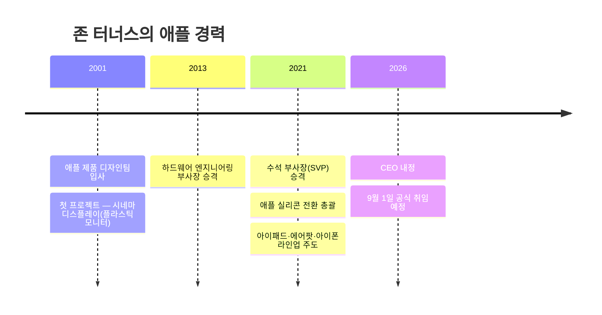

> 스티브 잡스가 '예술가'였고, 팀 쿡이 '관리자'였다면 — 존 터너스는 '빌더(Builder)'다.

## 이 글에서 다루는 내용

- 팀 쿡이 지금 사임하는 이유와 실제 배경
- 존 터너스가 어떤 인물인지, 왜 그가 선택됐는지
- 팀 쿡 15년이 애플에 남긴 숫자들
- 새 체제에서 주목해야 할 인물과 구조 변화
- 터너스 앞에 놓인 진짜 과제들

---

## 4월 21일, 조용히 터진 폭탄

지난 4월 21일, 애플이 공식 발표 하나를 올렸다. 팀 쿡이 CEO에서 물러나고, 하드웨어 엔지니어링 부문 수석 부사장 존 터너스가 **2026년 9월 1일부로 CEO직을 승계**한다는 내용이었다.

이사회의 만장일치 결정이었으며, "장기적이고 신중한 승계 계획 프로세스"의 결과라고 애플 측은 밝혔다. 주가는 발표 직후 시간외거래에서 0.5% 하락했지만, 시장은 빠르게 안정을 되찾았다. 폭탄치고는 꽤 질서정연한 폭발이었다.

---

## 팀 쿡은 왜 지금 물러나나


건강 이상설이 먼저 돌았다. 쿡은 65세로, 경영 일선에서는 물러나지만 이사회 의장으로 남아 글로벌 정책 대응 역할을 계속 수행할 예정이다. 자진 은퇴에 가깝다.

타이밍이 절묘한 데는 이유가 있다. 내부적으로 세 가지 조건이 맞아떨어진 시점이라는 분석이 많다.

```text
✅ 시가총액 4조 달러 — 역대 최고 수준의 기업 가치
✅ 제품 라인업 — 폴더블 아이폰 등 미래 먹거리 준비 완료
✅ 준비된 후계자 — 존 터너스의 25년 경력과 입증된 실행력
```

동시에 이번 인사 이면에는 조니 스루지(Johny Srouji)의 이탈 리스크를 막기 위한 포석도 있었다는 분석이 있다. 새롭게 신설된 최고 하드웨어 책임자(Chief Hardware Officer) 직책으로 스루지를 승격시킴으로써, 터너스 임명의 사전 조건이 충족됐다는 것이다.

---

## 팀 쿡 15년이 남긴 것들

비판도 있었다. "잡스였으면 이렇게 안 했을 것"이라는 말이 항상 따라다녔다. 그러나 숫자는 다른 이야기를 한다.

| 항목 | 취임 시 (2011) | 퇴임 시 (2026) |
|---|---|---|
| 시가총액 | 약 3,500억 달러 | 약 4조 달러 |
| 주가 수익률 | — | +1,933% |
| 서비스 매출 | 사실상 없음 | 핵심 성장 동력으로 성장 |
| 제품군 | iPhone, Mac, iPod | iPhone, Mac, iPad, Watch, AirPods, Vision Pro, 서비스 부문 전체 |

쿡 재임 기간 동안 애플 주가는 1,933% 상승했다. S&P 500 상승률의 거의 4배에 달하는 수치다.

공급망을 '신의 영역'으로 끌어올린 것도 쿡의 유산이다. 재고를 "악(Evil)"이라 불렀던 그의 철학은 아이폰 수요가 출렁일 때마다 빛을 발했다. 서비스 부문을 제2의 성장 엔진으로 키운 것도, 애플 뮤직·iCloud·애플 TV+가 지금의 위치에 있는 것도 쿡 시대의 작품이다.

---

## 존 터너스, 그는 누구인가


2024년 펜실베이니아대 공대 졸업식 축사에서 터너스는 애플 입사 첫날을 "설레면서도 두려웠다"고 회고하며, "내가 여기 있을 자격이 있는지 확신이 서지 않았다"고 말했다. 하드웨어 제국의 차기 수장치고는 의외로 솔직한 고백이다.

애플 실리콘 전환 당시, 맥이 인텔에서 자체 칩으로 넘어오는 하드웨어 엔지니어링 전체를 총괄한 인물이 바로 터너스다. 그는 애플의 8번째 CEO가 된다.



팀 쿡이 그를 가리키며 한 말이 지금까지 회자된다.

> *존 터너스는 엔지니어의 머리, 혁신가의 영혼, 그리고 정직하게 이끄는 심장을 가진 인물이다.*

---

## 새 체제에서 주목할 인물들

터너스 혼자 이 배를 모는 게 아니다. 새 리더십 구조를 함께 봐야 한다.

**조니 스루지 — 최고 하드웨어 책임자(CHO)**
애플 칩(M시리즈, A시리즈)의 설계 총책임자. M4 칩을 설계한 인물이 이 자리에 앉았다는 건, 애플이 하드웨어 수직계열화에 더 세게 베팅한다는 신호다.

**팀 쿡 — 이사회 의장**
경영 일선에서는 빠지지만 완전히 사라지는 게 아니다. 트럼프 행정부와의 관세 협상, 중국 시장 리스크 관리 같은 지정학적 문제는 여전히 쿡의 몫이 될 가능성이 높다.

**아서 레빈슨 — 선임 독립이사로 전환**
15년간 비상임 의장직을 맡아온 그가 독립이사로 물러나며 사실상 거버넌스 구조도 함께 개편됐다.

---

## 터너스 앞에 놓인 진짜 과제

하드웨어로 올라온 CEO가 풀어야 할 가장 큰 숙제는 아이러니하게도 **소프트웨어**다.

### AI 역전승이 가능한가

애플은 구글, 마이크로소프트, 메타가 수천억 달러를 AI 데이터센터에 퍼붓는 동안, 대규모 자본 지출을 피하는 전략을 유지해왔다. 자체 파운데이션 모델 개발에도 소극적이어서, 주요 AI 기능의 핵심을 구글 제미나이에 의존하는 상황이다.

Morgan Stanley 애널리스트들은 "터너스의 CEO 승격은 애플이 제품을 중심에 두는 전략을 유지하겠다는 명확한 신호"라고 평가했다.


애플의 AI 전략은 "모델을 직접 만드는 것"보다 "우리 하드웨어 위에서 AI가 가장 잘 돌아가게 만드는 것"에 가깝다. 터너스의 배경이 오히려 이 방향에 맞는다는 시각도 있다.


### 폴더블 아이폰, 터너스의 첫 무대

애플은 올해 9월 첫 폴더블 아이폰 출시를 앞두고 있다. 창사 이래 아이폰의 가장 큰 변화가 될 수 있고, 어쩌면 터너스가 CEO로서 맞이하는 첫 번째 제품 발표가 될 수 있다.

### "아이폰 이후"라는 질문


업계에서 가장 자주 나오는 질문은 단순하다 — "아이폰 다음은 뭔가?" AI 웨어러블이 그 후보군으로 급부상 중이며, 스마트 안경·펜던트·카메라 탑재 에어팟이 개발 중이라는 보도가 이어지고 있다.

---

## 마치며

경영의 팀 쿡이 떠나고, 하드웨어의 존 터너스가 온다. 애플 역사에서 세 번째 CEO다. 잡스가 비전을 만들고, 쿡이 제국을 키웠다면 — 터너스는 그 제국이 AI 시대에도 제국으로 남을 수 있는지를 증명해야 한다.

9월 1일이 기다려지는 이유는 충분하다. 폴더블 아이폰, AI 웨어러블, 그리고 "터너스의 애플"이 어떤 목소리를 낼지. 그 첫 장면이 올 가을 쓰여진다.
