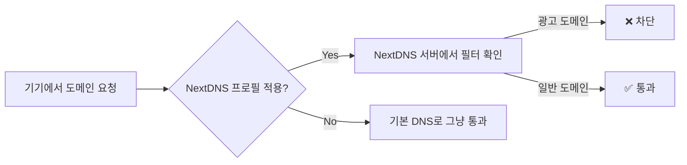

> DNS 차단은 광고 데이터가 기기에 도달하기 전, 길목에서 막는다. 브라우저 확장 프로그램보다 가볍고, 앱 내 광고까지 잡는다.

## 이 글에서 다루는 내용

- DNS 기반 광고 차단이 확장 프로그램보다 나은 이유
- NextDNS 계정 생성 및 차단 필터 설정 방법
- 아이폰/아이패드·맥에 프로필 설치하는 방법 (단계별)
- 한국 환경에 최적화된 필터 추천
- 공용 와이파이(스타벅스·카페) 대처법
- 무료 플랜으로 얼마나 쓸 수 있는지

---

## DNS 차단 vs 브라우저 확장 프로그램, 뭐가 다른가

| 비교 항목 | 브라우저 확장 프로그램 | NextDNS 프로필 (DNS 방식) |
|---|---|---|
| 차단 범위 | 사파리·크롬 **브라우저 내부만** | **기기 전체** (앱, 게임, 시스템 포함) |
| 성능 영향 | 필터 많을수록 로딩 속도 저하 가능 | 거의 없음 (길목에서 주소만 확인) |
| 배터리 소모 | 후처리 과정에서 CPU 사용 | 무시할 수 있는 수준 |
| 광고 빈자리 | 빈 공간까지 정리됨 | 빈칸이 남을 수 있음 |
| 앱 내 광고 | ❌ 차단 불가 | ✅ 차단 가능 |

DNS(Domain Name System)는 도메인 이름을 IP 주소로 바꿔주는 전화번호부 같은 시스템이다. NextDNS는 이 과정에서 광고·트래커 도메인 주소 요청 자체를 차단해버린다. 광고 데이터가 기기에 도달하기도 전에 막는 구조라 가볍고 빠르다.


애플은 iOS 14, macOS Big Sur부터 **네이티브 암호화 DNS(DoH/DoT)** 를 공식 지원한다. 덕분에 별도 앱 없이 설정 프로필 하나만으로 적용이 가능하다.


---

## STEP 1. NextDNS 계정 만들기

가장 먼저 할 일은 계정 생성이다.

1. **[nextdns.io](https://nextdns.io)** 접속 → 우측 상단 **Try it for free** 클릭
2. 이메일 주소로 계정 생성
3. 로그인하면 대시보드가 열리고, **Configuration ID(6자리 영숫자)**가 자동 발급된다

이 ID가 이후 프로필 생성과 기기 식별의 핵심 키다. 잘 복사해두자.

---

## STEP 2. 차단 필터 설정하기 (Privacy 탭)

프로필을 내려받기 전에 먼저 **어떤 광고를 막을지** 설정해야 한다. 대시보드 → **Privacy** 탭 → **ADD A BLOCKLIST** 버튼을 클릭한다.

### 추천 필터 조합 (한국 환경 기준)

| 필터 | 설명 | 추천 여부 |
|---|---|---|
| **HaGeZi – Multi PRO** | 광고·트래커 포괄 차단, 글로벌 기준 최고 수준 | ✅ 필수 |
| **YousList** | 한국 웹 환경 특화 필터 | ✅ 필수 |
| NextDNS Ads & Trackers Blocklist | HaGeZi와 많이 겹침 | ❌ 제거 권장 |


필터를 너무 많이 추가하면 일부 사이트·앱이 정상 작동하지 않을 수 있다. 처음엔 위 두 개만 추가하고, 문제가 생기면 로그에서 원인 도메인을 찾아 허용 목록에 추가하는 방식이 낫다.


### Privacy 탭 추가 설정

- **Block Disguised Third-Party Trackers** → 체크 ✅ (CNAME으로 위장한 트래커 차단)
- **Allow Affiliate & Tracking Links** → 체크 ✅ (제휴 링크 차단으로 인한 접속 오류 방지)

---

## STEP 3. 성능 최적화 (Settings 탭)

**Settings** 탭 → **Performance** 항목에서 **Cache Boost**를 켜준다.

동일한 도메인 쿼리를 캐시해서 처리하므로 응답 속도가 빨라지고, 무료 플랜의 월 쿼리 소비도 줄어든다. 반드시 켜두자.

---

## STEP 4. 프로필 생성 및 설치

이제 실제로 기기에 적용할 프로필을 만들 차례다.

### 프로필 생성

**사파리**에서 **[apple.nextdns.io](https://apple.nextdns.io)** 접속 후 아래 항목을 입력한다.

```text
Configuration ID : 대시보드에서 복사한 6자리 ID
Device Name      : 관리 편의를 위한 기기 이름 (예: Hanseob-iPhone)
```

입력 후 **Download** 버튼을 누르면 `.mobileconfig` 파일이 다운로드된다.


`사파리`에서만 다운로드해야 한다. 크롬이나 파이어폭스에서는 프로필 파일이 제대로 설치되지 않는다.


### 아이폰 / 아이패드 설치

```text
설정 → 일반 → VPN 및 기기 관리 → 다운로드된 프로필 탭
→ [설치] 버튼 → 암호 입력 → [설치] 완료
```

설치 후 `설정 → 일반 → VPN, DNS 및 기기 관리 → DNS`에서 **NextDNS**로 표시되면 정상이다.

### 맥 설치

```text
다운로드된 .mobileconfig 파일 더블 클릭
→ 시스템 설정 → 개인정보 보호 및 보안 → 프로필
→ 다운로드된 항목 클릭 → [설치] 완료
```


macOS Ventura(13) 이상에서는 `시스템 설정 → 개인정보 보호 및 보안 → 프로필` 경로를 사용한다. 구버전 macOS는 `시스템 환경설정 → 프로필`에서 찾으면 된다.


---

## STEP 5. 동작 확인

설치 후 브라우저에서 **[test.nextdns.io](https://test.nextdns.io)**에 접속하면 NextDNS가 정상 동작 중인지 확인할 수 있다.



---

## 실사용 팁: 블랙리스트·화이트리스트 관리

프로필을 한 번 설치하면 이후 **차단 목록 수정은 NextDNS 웹 대시보드에서만** 하면 된다. 기기를 건드릴 필요가 없다.

**특정 앱 광고가 심할 때 (차단 추가)**
대시보드 → **Logs** 탭에서 해당 앱이 쏘는 광고 도메인을 찾아 차단 버튼을 누르면 즉시 적용된다.

**결제창·로그인이 안 열릴 때 (허용 추가)**
대시보드 → **Allowlist**에 해당 도메인을 추가한다. 네이버 서비스가 간혹 문제가 될 수 있는데, 이 경우 `naver.com` 계열 도메인을 허용 목록에 넣으면 해결된다.

---

## 공용 와이파이(스타벅스·카페) 문제 해결

스타벅스나 공항 와이파이처럼 접속 시 **로그인 페이지(Captive Portal)** 가 떠야 하는 곳에서 DNS 차단 때문에 페이지가 안 열리는 경우가 있다.

### 즉석 해결법

```text
설정 → 일반 → VPN, DNS 및 기기 관리 → DNS
→ [자동]으로 변경 → 와이파이 로그인 완료 후 다시 [NextDNS]로 복원
```

### 미리 설정해두는 방법

프로필 생성 시 **Excluded Wi-Fi Networks** 항목에 자주 가는 카페의 SSID를 등록해두면, 해당 와이파이에서만 자동으로 NextDNS가 비활성화된다. 매번 수동으로 끄고 켤 필요가 없어진다.

---

## 무료 플랜으로 충분할까?

무료 플랜은 매월 30만 쿼리까지 사용 가능하며, 한도 초과 시 차단 기능만 멈추고 인터넷 자체는 정상 작동한다. 광고 차단이 잠깐 꺼지는 것이지, 인터넷이 끊기는 건 아니다.

실사용 기준으로는 맥북·아이폰·아이패드를 함께 쓰더라도 한 달 30만 쿼리는 넉넉한 편이다. Cache Boost를 켜두면 소비를 더 줄일 수 있다. 더 많이 쓰고 싶다면 유료 플랜은 월 $1.99(연간 $19.90)에 무제한 쿼리를 제공한다.

| 플랜 | 가격 | 쿼리 한도 |
|---|---|---|
| Free | 무료 | 월 300,000건 |
| Pro | 월 $1.99 / 연 $19.90 | 무제한 |

---

## 마치며

NextDNS 프로필 방식은 한 번 설치해두면 관리할 게 거의 없다. 차단 목록은 서버에서 자동 업데이트되고, 기기는 그저 그 서버를 바라보고 있을 뿐이다. 맥북과 아이폰을 오가며 쓰는 사람에게 특히 효율적인 구성이다.

광고 없는 인터넷이 이렇게 가벼울 수 있다는 걸, 설치해보면 바로 느낀다.
