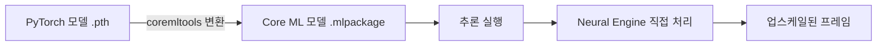

> 이 글은 macOS 15, Python 3.10, Miniconda 기준으로 작성되었다.

## 이 글에서 다루는 내용

- ncnn-vulkan 방식의 한계와 MLModel 방식이 필요한 이유
- Apple Neural Engine이 업스케일링에서 어떤 역할을 하는지
- Homebrew와 Miniconda로 격리된 Python 환경 구성하기
- Real-ESRGAN 의존성 설치 및 사전 학습 모델 다운로드

## 왜 ncnn-vulkan으로는 부족한가

Mac에서 Real-ESRGAN을 쓰는 가장 흔한 방법은 `realesrgan-ncnn-vulkan` 바이너리를 내려받아 실행하는 것이다. GitHub에서 zip 하나 풀면 되니 진입 장벽이 낮다. 그런데 M 시리즈 Mac에서 실제로 돌려보면 생각보다 느리다는 걸 금방 느끼게 된다.

이유는 간단하다. ncnn-vulkan은 Vulkan API를 GPU 백엔드로 사용하는데, Apple Silicon의 GPU는 Metal을 기본으로 한다. Vulkan과 Metal 사이에는 MoltenVK라는 변환 레이어가 끼어들고, 이 과정에서 성능 손실이 발생한다. 게다가 배포된 바이너리가 `arm64` 단일 아키텍처가 아닌 `universal2`(intel + arm64 혼합)로 빌드된 경우엔 Rosetta 2를 거쳐 실행될 수도 있다.

정리하면 이렇다.

| 방식 | GPU 활용 | Neural Engine | Apple Silicon 최적화 |
|---|---|---|---|
| ncnn-vulkan | Metal (MoltenVK 경유) | ❌ | 부분적 |
| MLModel 변환 | MPS (Metal Performance Shaders) | ✅ | 완전 |

MLModel 방식은 PyTorch 모델을 Apple의 `.mlmodel` 포맷으로 변환해서, 추론(업스케일 실행) 단계에서 Neural Engine을 직접 활용한다. M 시리즈 칩에 내장된 Neural Engine은 행렬 연산에 특화된 하드웨어인데, 이걸 쓰는 것과 안 쓰는 것 사이의 속도 차이는 꽤 크다.

## Neural Engine이 뭔데 이렇게 빠른가

Neural Engine은 CPU나 GPU와는 별개의 전용 칩이다. Apple이 M 시리즈에 내장한 이 유닛은 초당 수조 번의 행렬 연산을 처리하도록 설계됐다. 이미지 픽셀을 수백만 개의 파라미터로 예측해서 확장하는 업스케일링 연산은 Neural Engine이 가장 잘하는 종류의 작업이다.

일반적인 파이썬 딥러닝 코드는 PyTorch + CUDA 조합을 전제로 짜여 있다. Mac에서 이 코드를 그대로 돌리면 GPU 대신 CPU로 폴백되거나, MPS를 통해 Metal GPU를 쓰는 정도에 그친다. Neural Engine을 쓰려면 모델을 Apple의 Core ML 포맷(`.mlpackage` 또는 `.mlmodel`)으로 변환하는 과정이 필요하다. 이 변환을 한 번만 해두면, 이후 추론은 Neural Engine이 전담한다.



## 환경 준비: Homebrew와 Miniconda

본격적인 설치에 앞서 두 가지를 먼저 갖춰야 한다. Homebrew는 macOS 패키지 관리자고, Miniconda는 Python 가상 환경을 만들어주는 도구다. 업스케일링 프로젝트 전용 환경을 격리해두면, 다른 Python 프로젝트와 의존성 충돌을 피할 수 있다.

### Homebrew 설치

터미널을 열고 아래 명령을 실행한다. 이미 설치돼 있다면 이 단계는 건너뛰어도 된다.

```bash
/bin/bash -c "$(curl -fsSL https://raw.githubusercontent.com/Homebrew/install/HEAD/install.sh)"
```

설치 후 `brew --version`으로 정상 동작을 확인한다.

### Miniconda 설치 및 환경 생성

```bash
# Miniconda 설치
brew install miniconda

# 설치 후 셸 초기화 (zsh 기준)
conda init zsh

# 터미널 재시작 또는 설정 적용
source ~/.zshrc
```

이제 업스케일링 전용 환경을 만든다. Python 버전은 3.10을 권장한다. 최신 버전에서는 일부 의존성이 호환되지 않을 수 있다.

```bash
# 전용 환경 생성
conda create --prefix ~/upscale-env python=3.10

# 환경 활성화
conda activate ~/upscale-env
```

프롬프트 앞에 `(~/upscale-env)`가 표시되면 환경이 정상적으로 활성화된 것이다. 이후 모든 설치와 실행은 이 환경 안에서 진행한다.


`--prefix` 옵션으로 경로를 직접 지정하면 환경 이름 대신 경로로 관리된다. `conda env list`로 목록을 확인할 수 있다.


## 프로젝트 폴더 구성

작업 공간을 정리해두면 나중에 헷갈리지 않는다.

```bash
mkdir ~/upscale-project
cd ~/upscale-project
mkdir pre-trained_models input_frames output_frames
```

| 폴더 | 용도 |
|---|---|
| `pre-trained_models/` | 다운로드한 `.pth` 모델 파일 |
| `input_frames/` | ffmpeg으로 추출한 원본 프레임 |
| `output_frames/` | 업스케일된 결과 프레임 |

## 의존성 설치

환경이 활성화된 상태에서 필요한 패키지를 설치한다.

```bash
# PyTorch (MPS 지원 버전)
pip install torch torchvision

# Core ML 변환 도구
pip install coremltools

# Real-ESRGAN
pip install realesrgan

# 기타 유틸리티
pip install basicsr facexlib gfpgan
```

설치가 완료되면 PyTorch가 MPS를 인식하는지 확인해보자.

```bash
python -c "import torch; print(torch.backends.mps.is_available())"
```

`True`가 출력되면 GPU 가속 준비가 된 것이다.


모델 변환 과정은 메모리를 많이 사용한다. 8GB RAM 환경에서는 동작이 불안정할 수 있다. 변환 작업 전에 브라우저, 코드 에디터 등 무거운 앱을 닫아두는 걸 권장한다.


## 사전 학습 모델 다운로드

Real-ESRGAN은 여러 종류의 사전 학습 모델을 제공한다. DVD 실사 영상에는 `realesr-general-x4v3`와 `realesr-general-wdn-x4v3` 두 모델을 모두 받아두고 나중에 비교해보는 게 좋다. (애니메이션 소스라면 `realesr-animevideov3`를 추가로 받아두면 된다.)

```bash
cd ~/upscale-project/pre-trained_models

# 범용 실사 모델 v3
wget https://github.com/xinntao/Real-ESRGAN/releases/download/v0.2.5.0/realesr-general-x4v3.pth

# 노이즈 제거 강화 모델 (wdn = with denoising)
wget https://github.com/xinntao/Real-ESRGAN/releases/download/v0.2.5.0/realesr-general-wdn-x4v3.pth
```


`wget`이 없다면 `brew install wget`으로 먼저 설치한다.


두 모델의 차이는 이렇다.

| 모델 | 특징 | 추천 소스 |
|---|---|---|
| `realesr-general-x4v3` | 디테일 복원에 강함 | 압축이 심하지 않은 영상 |
| `realesr-general-wdn-x4v3` | 노이즈 제거 병행 | DVD처럼 그레인이 있는 영상 |
| `realesr-animevideov3` | 애니메이션 선 처리 최적화 | 애니메이션 소스 |

DVD 영상은 오래된 MPEG-2 압축 특성상 블록 노이즈와 필름 그레인이 함께 섞여 있는 경우가 많다. 일단 둘 다 테스트해보고 결과물을 비교하는 걸 추천한다.

## 마치며

1편에서는 왜 MLModel 방식이 Apple Silicon에서 더 유리한지, 그리고 그 방식을 쓰기 위한 환경을 어떻게 구성하는지를 다뤘다. Homebrew, Miniconda, PyTorch, coremltools, Real-ESRGAN까지 설치가 완료됐다면 절반은 온 셈이다.

2편에서는 이 모델을 실제로 Core ML 포맷으로 변환하고, ffmpeg으로 추출한 프레임에 적용해 업스케일링을 완료하는 전 과정을 다룬다. 챕터 단위 배치 처리 스크립트도 함께 정리할 예정이다.
